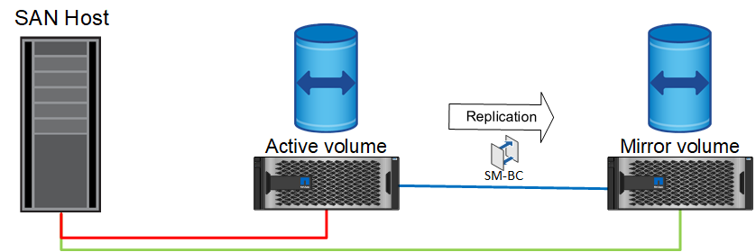
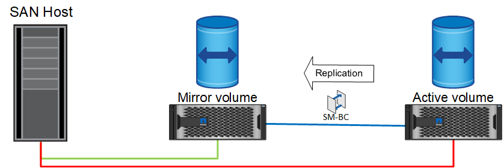

= Fonctionnement normal
:allow-uri-read: 

La synchronisation active SnapMirror prend en charge deux types d'opérations de basculement du stockage, planifiées et non planifiées, qui fonctionnent de manières légèrement différentes. Un basculement planifié est initié manuellement par l'administrateur pour permettre un basculement rapide vers un site distant, tandis que le basculement non planifié est automatiquement initié par le médiateur sur le troisième site. L'objectif principal d'un basculement planifié est d'effectuer des correctifs et des mises à niveau incrémentiels, d'effectuer des tests de reprise après incident ou d'adopter une politique formelle de basculement des opérations entre les sites tout au long de l'année afin de démontrer la capacité de synchronisation active complète.

Les diagrammes présentent ce qui se produit pendant les opérations normales, de basculement et de restauration. Pour plus de clarté, ils représentent un LUN répliqué. Dans une configuration de synchronisation active SnapMirror, la réplication est basée sur des volumes, où chaque volume contient une ou plusieurs LUN, mais pour simplifier l'image, la couche du volume a été supprimée.

== Fonctionnement normal

En fonctionnement normal, une LUN est accessible à partir du réplica local ou distant. La ligne rouge indique le chemin optimisé annoncé par ALUA, qui doit s'assurer que les E/S sont préférablement envoyées sur ce chemin.

La ligne verte est un chemin actif, mais elle subirait plus de latence, car les E/S sur ce chemin devront être transmises sur le chemin de synchronisation actif SnapMirror. La latence supplémentaire dépend de la vitesse de l'interconnexion entre les sites utilisés pour la synchronisation active SnapMirror.

== Panne

Si la copie miroir active devient indisponible, en raison d'un basculement planifié ou non planifié, elle ne sera évidemment plus utilisable. Cependant, le système distant possède une réplique synchrone et des chemins SAN vers le site distant existent déjà. Le système distant peut traiter les E/S pour cette LUN.

image:../media/smas-failover-2.png["Échec de la synchronisation active SnapMirror"]

== Basculement

Le basculement entraîne la copie distante en tant que copie active. Les chemins passent de actif à actif/optimisé et les E/S continuent d'être traitées sans perte de données.

image:../media/smas-failover-3.png["Basculement de la synchronisation active SnapMirror"]

== Réparation

Une fois le système source remis en service, la synchronisation active SnapMirror peut resynchroniser la réplication, tout en exécutant l'autre direction. La configuration est maintenant essentiellement la même que le point de départ, sauf que les sites actifs-miroirs ont été inversés.

== Du rétablissement

Si vous le souhaitez, un administrateur peut effectuer un retour arrière et déplacer la copie active de la ou des LUN vers les contrôleurs d'origine.

