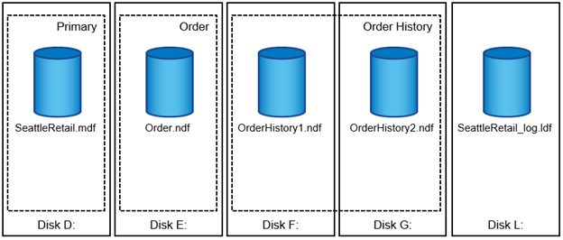
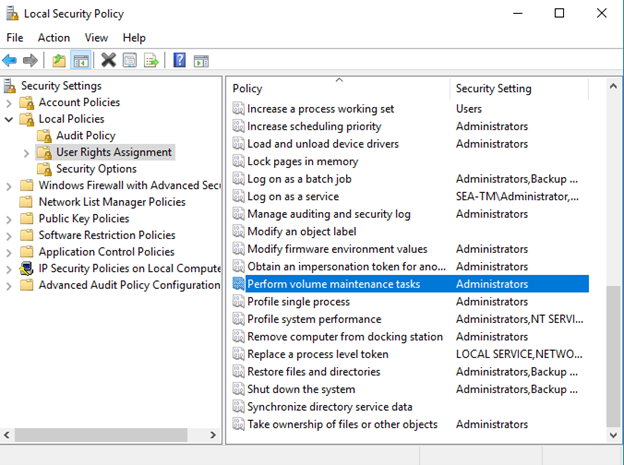
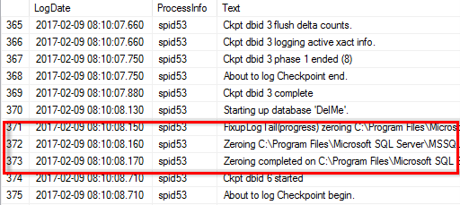
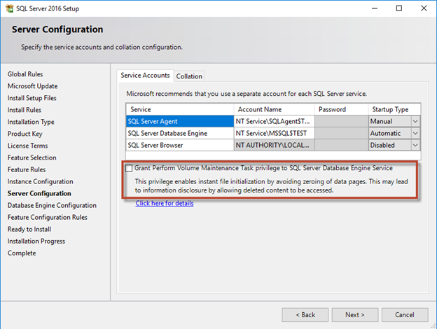

= Fichiers de base de données et groupes de fichiers Microsoft SQL Server
:allow-uri-read: 

[role="lead"]
Une base de données SQL Server est une collection d'objets qui vous permet de stocker et de manipuler des données.

En théorie, SQL Server (64 bits) prend en charge 32,767 bases de données par instance et 524 272 To de taille de base de données, bien que l'installation standard comporte généralement plusieurs bases de données. Cependant, le nombre de bases de données que SQL Server peut gérer dépend de la charge et du matériel. Il n'est pas rare que des instances SQL Server hébergent des dizaines, des centaines, voire des milliers de petites bases de données.

Chaque base de données se compose d'un ou plusieurs fichiers de données et d'un ou plusieurs fichiers journaux de transactions. Le journal de transactions stocke les informations sur les transactions de base de données et toutes les modifications de données effectuées par chaque session. Chaque fois que les données sont modifiées, SQL Server stocke suffisamment d'informations dans le journal de transactions pour annuler (revenir en arrière) ou rétablir (relire) l'action. Un journal de transactions SQL Server fait partie intégrante de la réputation de SQL Server en matière d'intégrité et de robustesse des données. Le journal de transactions est essentiel aux capacités d'atomicité, de cohérence, d'isolation et de durabilité (ACIDE) de SQL Server. SQL Server écrit dans le journal de transactions dès qu'une modification de la page de données se produit. Chaque instruction Data manipulation Language (DML) (par exemple, Select, INSERT, Update ou DELETE) est une transaction complète, et le journal de transactions s'assure que l'opération basée sur l'ensemble a lieu, en s'assurant de l'atomicité de la transaction.

Chaque base de données possède un fichier de données primaire, qui, par défaut, possède l'extension .mdf. En outre, chaque base de données peut avoir des fichiers de base de données secondaires. Ces fichiers, par défaut, ont des extensions .ndf.

Tous les fichiers de base de données sont regroupés en groupes de fichiers. Un groupe de fichiers est l'unité logique, qui simplifie l'administration de la base de données. Ils permettent de séparer le placement d'objets logiques des fichiers de base de données physiques. Lorsque vous créez les tables d'objets de base de données, vous spécifiez dans quel groupe de fichiers elles doivent être placées sans vous soucier de la configuration du fichier de données sous-jacent.

La possibilité de placer plusieurs fichiers de données dans le groupe de fichiers vous permet de répartir la charge entre les différents périphériques de stockage, ce qui contribue à améliorer les performances d'E/S du système. En revanche, le journal de transactions ne bénéficie pas des multiples fichiers car SQL Server écrit dans le journal de transactions de manière séquentielle.

La séparation entre le placement d'objets logiques dans les groupes de fichiers et les fichiers de base de données physiques vous permet d'affiner la disposition des fichiers de base de données, en tirant le meilleur parti du sous-système de stockage. Par exemple, les éditeurs de logiciels indépendants qui déploient leurs produits auprès de différents clients peuvent ajuster le nombre de fichiers de base de données en fonction de la configuration d'E/S sous-jacente et de la quantité de données attendue au cours de la phase de déploiement. Ces modifications sont transparentes pour les développeurs d'applications, qui placent les objets de base de données dans les groupes de fichiers plutôt que dans les fichiers de base de données.

TIP: *NetApp recommande* d'éviter l'utilisation du groupe de fichiers principal pour tout autre objet que les objets système. La création d'un groupe de fichiers distinct ou d'un ensemble de groupes de fichiers pour les objets utilisateur simplifie l'administration de la base de données et la reprise après incident, en particulier dans le cas de bases de données volumineuses.

Vous pouvez spécifier la taille initiale du fichier et les paramètres de croissance automatique au moment de la création de la base de données ou de l'ajout de nouveaux fichiers à une base de données existante. SQL Server utilise un algorithme de remplissage proportionnel lors du choix du fichier de données dans lequel il doit écrire des données. Elle écrit une quantité de données proportionnellement à l'espace libre disponible dans les fichiers. Plus l'espace libre dans le fichier est important, plus il traite d'écritures.

TIP: *NetApp recommande* que tous les fichiers d'un seul groupe de fichiers aient les mêmes paramètres de taille initiale et de croissance automatique, avec la taille de croissance définie en mégaoctets plutôt qu'en pourcentages. Cela permet à l'algorithme de remplissage proportionnel d'équilibrer uniformément les activités d'écriture entre les fichiers de données.

Chaque fois que SQL Server augmente les fichiers, il remplit l'espace nouvellement alloué dans les fichiers avec des zéros. Ce processus bloque toutes les sessions qui doivent écrire dans le fichier correspondant ou, en cas de croissance du journal de transactions, générer des enregistrements de journal de transactions.

SQL Server met toujours à zéro le journal de transactions et ce comportement ne peut pas être modifié. Toutefois, vous pouvez contrôler si les fichiers de données sont mis à zéro en activant ou en désactivant l'initialisation instantanée des fichiers. L'activation de l'initialisation instantanée des fichiers permet d'accélérer la croissance des fichiers de données et de réduire le temps nécessaire à la création ou à la restauration de la base de données.

Un petit risque de sécurité est associé à l'initialisation instantanée des fichiers. Lorsque cette option est activée, les parties non allouées du fichier de données peuvent contenir des informations provenant de fichiers OS précédemment supprimés. Les administrateurs de base de données peuvent examiner ces données.

Vous pouvez activer l'initialisation instantanée des fichiers en ajoutant l'autorisation sa_MANAGE_VOLUME_NAME, également appelée « effectuer une tâche de maintenance de volume » au compte de démarrage SQL Server. Vous pouvez le faire sous l'application de gestion des stratégies de sécurité locales (secpol.msc), comme indiqué dans la figure suivante. Ouvrez les propriétés de l'autorisation "effectuer une tâche de maintenance de volume" et ajoutez le compte de démarrage SQL Server à la liste des utilisateurs.

Pour vérifier si l'autorisation est activée, vous pouvez utiliser le code de l'exemple suivant. Ce code définit deux indicateurs de suivi qui forcent SQL Server à écrire des informations supplémentaires dans le journal d'erreurs, à créer une petite base de données et à lire le contenu du journal.

....
DBCC TRACEON(3004,3605,-1)

GO

CREATE DATABASE DelMe

GO

EXECUTE sp_readerrorlog

GO

DROP DATABASE DelMe

GO

DBCC TRACEOFF(3004,3605,-1)

GO
....
Lorsque l'initialisation instantanée des fichiers n'est pas activée, le journal d'erreurs SQL Server indique que SQL Server met à zéro le fichier de données mdf en plus de mettre à zéro le fichier journal ldf, comme indiqué dans l'exemple suivant. Lorsque l'initialisation instantanée des fichiers est activée, elle affiche uniquement la remise à zéro du fichier journal.

La tâche de maintenance du volume Perform est simplifiée dans SQL Server 2016 et est fournie ultérieurement en option lors du processus d'installation. Cette figure affiche l'option permettant d'accorder au service du moteur de base de données SQL Server le privilège d'effectuer la tâche de maintenance du volume.

Une autre option de base de données importante qui contrôle la taille des fichiers de base de données est la fonction de transmission automatique. Lorsque cette option est activée, SQL Server réduit régulièrement les fichiers de base de données, réduit leur taille et libère de l'espace dans le système d'exploitation. Cette opération consomme beaucoup de ressources et est rarement utile car les fichiers de base de données augmentent à nouveau après l'arrivée de nouvelles données dans le système. Autohrink ne doit jamais être activé sur la base de données.
