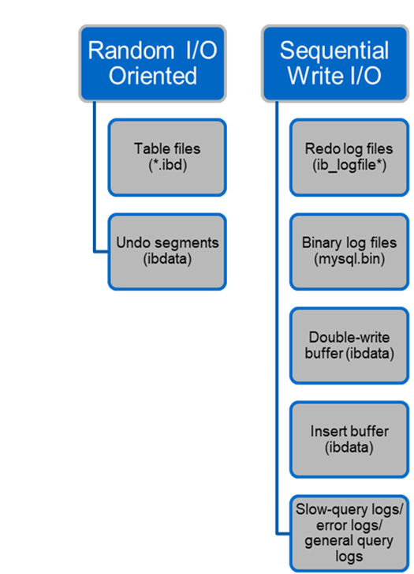

= Structure de fichier
:allow-uri-read: 
:icons: font
:imagesdir: ../media/

[role="lead"]
InnoDB agit comme la couche intermédiaire entre le stockage et le serveur MySQL, il stocke les données sur les lecteurs.

image:../media/mysql-file-structure1.png["Structure de fichier MySQL"]

Les E/S MySQL sont classées en deux types :

* E/S de fichiers aléatoires
* E/S séquentielles de fichiers

Les fichiers de données sont lus et écrasés de manière aléatoire, ce qui entraîne un nombre élevé d'IOPS. Un stockage SSD est donc recommandé.

Les fichiers redo log et les fichiers log binaires sont des journaux transactionnels. Ils sont écrits de manière séquentielle, ce qui vous permet d'obtenir de bonnes performances sur le disque dur avec le cache d'écriture. Une lecture séquentielle a lieu lors de la restauration, mais cela provoque rarement un problème de performance, car la taille du fichier journal est généralement inférieure à celle des fichiers de données et les lectures séquentielles sont plus rapides que les lectures aléatoires (se produisant sur les fichiers de données).

La mémoire tampon en double écriture est une fonction spéciale d'InnoDB. InnoDB écrit d'abord les pages vidées dans le tampon de double écriture, puis écrit les pages à leur position correcte sur les fichiers de données. Ce processus empêche la corruption de la page. Sans le tampon de double écriture, la page peut être corrompue si une panne de courant se produit pendant le processus d'écriture sur les lecteurs. L'écriture sur la mémoire tampon en double écriture étant séquentielle, elle est optimisée pour les disques durs. Les lectures séquentielles ont lieu lors de la restauration.

Comme la mémoire NVRAM ONTAP fournit déjà une protection en écriture, la mise en mémoire tampon en double écriture n'est pas nécessaire. MySQL a un paramètre, `skip_innodb_doublewrite`, pour désactiver le tampon de double écriture. Cette fonction peut améliorer considérablement les performances.

Le tampon d'insertion est également une fonction spéciale d'InnoDB. Si des blocs d'index secondaires non uniques ne sont pas en mémoire, InnoDB insère des entrées dans le tampon d'insertion pour éviter les opérations d'E/S aléatoires. Périodiquement, le tampon d'insertion est fusionné dans les arborescences d'index secondaires de la base de données. La mémoire tampon d'insertion réduit le nombre d'opérations d'E/S en fusionnant les demandes d'E/S vers le même bloc ; les opérations d'E/S aléatoires peuvent être séquentielles. Le tampon d'insertion est également hautement optimisé pour les disques durs. Les écritures et les lectures séquentielles ont lieu pendant les opérations normales.

Les segments d'annulation sont orientés E/S aléatoires. Pour garantir la simultanéité multiversion (MVCC), InnoDB doit enregistrer les anciennes images dans les segments d'annulation. La lecture des images précédentes à partir des segments d'annulation nécessite des lectures aléatoires. Si vous exécutez une longue transaction avec des lectures reproductibles (comme mysqldump—single transaction) ou exécutez une longue requête, les lectures aléatoires peuvent se produire. Par conséquent, le stockage des segments d'annulation sur des disques SSD est préférable dans ce cas. Si vous exécutez uniquement des transactions ou des requêtes courtes, les lectures aléatoires ne sont pas un problème.

[TIP]
====
*NetApp recommande* la disposition de conception de stockage suivante en raison des caractéristiques d'E/S InnoDB.

* Un volume pour stocker des fichiers MySQL orientés E/S aléatoires et séquentielles
* Un autre volume pour stocker des fichiers MySQL orientés E/S purement séquentiels

Cette disposition vous aide également à concevoir des stratégies et des règles de protection des données.

====