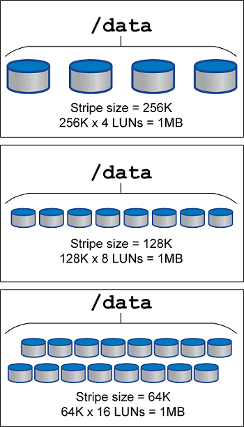

= Répartition LVM
:hardbreaks:
:allow-uri-read: 
:nofooter: 
:icons: font
:linkattrs: 
:imagesdir: ../media/

[role="lead"]
La répartition des LVM consiste à distribuer les données entre plusieurs LUN. Les performances de nombreuses bases de données en sont ainsi considérablement améliorées.

Avant l'ère des disques Flash, la répartition était utilisée pour surmonter les limites de performances des disques rotatifs. Par exemple, si un système d'exploitation doit effectuer une opération de lecture de 1 Mo, la lecture de ce 1 Mo de données à partir d'un seul disque demande beaucoup de tête de lecture lorsque le transfert des 1 Mo est lent. Si ce 1 Mo de données a été réparti sur 8 LUN, le système d'exploitation pourrait exécuter huit opérations de lecture de 128 K en parallèle et réduire le temps nécessaire au transfert de 1 Mo.

Le découpage avec des disques durs rotatifs était plus difficile car le schéma d'E/S devait être connu à l'avance. Si le découpage en bandes n'était pas correctement paramétré pour les véritables configurations d'E/S, les configurations découpées en bandes pouvaient nuire aux performances. Avec les bases de données Oracle, et en particulier avec les configurations de stockage tout flash, le striping est beaucoup plus facile à configurer et il a été prouvé qu'il améliore considérablement les performances.

Par défaut, les gestionnaires de volumes logiques, tels que la bande Oracle ASM, ne le font pas pour le système d'exploitation natif LVM. Certaines lient plusieurs LUN ensemble en tant que périphérique concaténé. Résultat : des fichiers de données existent sur un seul périphérique LUN. Ceci provoque des points chauds. Les autres implémentations LVM prennent par défaut en charge les extensions distribuées. Cette méthode est similaire à la répartition, mais elle est plus grossière. Les LUN du groupe de volumes sont tranchées en grandes parties, appelées extensions et généralement mesurées en plusieurs mégaoctets. Ensuite, les volumes logiques sont distribués sur ces extensions. Il en résulte des E/S aléatoires sur un fichier qui doit être bien réparti entre les LUN, mais les opérations d'E/S séquentielles ne sont pas aussi efficaces qu'elles pourraient l'être.

Les E/S des applications exigeantes en performances sont presque toujours de (a) en unités de taille de bloc de base ou (b) d'un mégaoctet.

L'objectif principal d'une configuration à bandes est de s'assurer que les E/S de fichier unique peuvent être exécutées comme une seule unité, et que les E/S de plusieurs blocs, d'une taille de 1 Mo, peuvent être parallélisées de façon homogène sur toutes les LUN du volume réparti. Cela signifie que la taille de bande ne doit pas être inférieure à la taille du bloc de base de données, et que la taille de bande multipliée par le nombre de LUN doit être de 1 Mo.

[NOTE]
====
Meilleures pratiques pour le striping LVM avec une base de données Oracle :

* Taille de la bande ≥ taille du bloc de base de données.
* Taille de la bande * nombre de LUN ≈ 1 Mo pour un parallélisme optimal.
* Utilisez plusieurs LUN par groupe de disques ASM pour maximiser le débit et éviter les points chauds.

====
La figure suivante présente trois options possibles pour le réglage de la taille et de la largeur des bandes. Le nombre de LUN est sélectionné pour répondre aux exigences de performances comme décrit ci-dessus, mais dans tous les cas, le total des données dans une seule bande est de 1 Mo.

