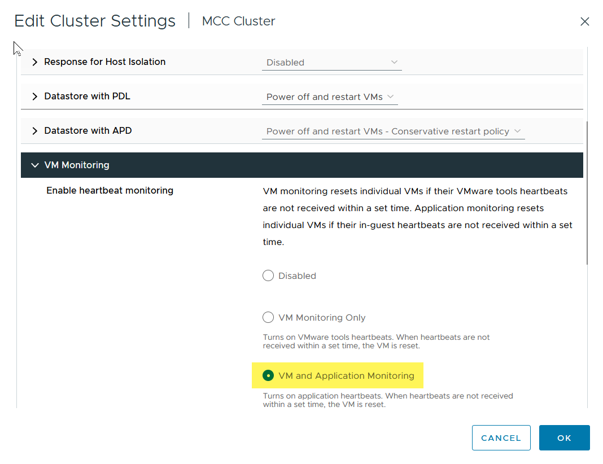
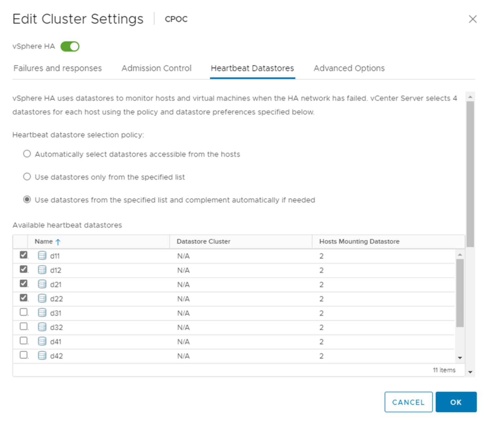
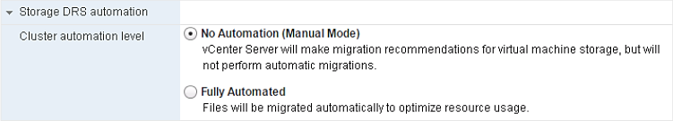

= Directives de conception et de mise en œuvre VMSC
:hardbreaks:
:allow-uri-read: 
:nofooter: 
:icons: font
:linkattrs: 
:imagesdir: ../media/

[role="lead"]
Ce document présente les lignes directrices en matière de conception et d'implémentation pour vMSC avec systèmes de stockage ONTAP.

== Configuration du stockage NetApp

Les instructions de configuration de NetApp MetroCluster (appelées « configuration MCC ») sont disponibles à l'adresse https://docs.netapp.com/us-en/ontap-metrocluster/["Documentation MetroCluster"]. Les instructions relatives à la synchronisation active SnapMirror (SMAs) sont également disponibles à l'adresse https://docs.netapp.com/us-en/ontap/smbc/index.html["Présentation de la continuité de l'activité SnapMirror"].

Une fois que vous avez configuré MetroCluster, son administration revient à gérer un environnement ONTAP traditionnel. Vous pouvez configurer des machines virtuelles de stockage (SVM) à l'aide de divers outils tels que l'interface de ligne de commande (CLI), System Manager ou Ansible. Une fois les SVM configurés, créez des interfaces logiques (LIF), des volumes et des LUN sur le cluster qui seront utilisés pour les opérations normales. Ces objets seront automatiquement répliqués sur l'autre cluster à l'aide du réseau de peering de cluster.

Si vous n'utilisez pas MetroCluster, vous pouvez utiliser la synchronisation active SnapMirror qui offre une protection granulaire du datastore et un accès actif-actif sur plusieurs clusters ONTAP dans différents domaines de défaillance. Les directeurs de groupe utilisent des groupes de cohérence (CGS) pour assurer la cohérence de l'ordre d'écriture dans un ou plusieurs datastores. Vous pouvez également créer plusieurs groupes de cohérence selon les besoins de votre application et de votre datastore. Les groupes de cohérence sont particulièrement utiles pour les applications qui nécessitent une synchronisation des données entre plusieurs datastores. Les SMAs prennent également en charge les mappages de périphériques Raw Device (RDM) et le stockage connecté par l'invité avec les initiateurs iSCSI invités. Pour en savoir plus sur les groupes de cohérence, rendez-vous sur https://docs.netapp.com/us-en/ontap/consistency-groups/index.html["Présentation des groupes de cohérence"].

Les outils ONTAP offrent désormais un moyen simple de configurer la synchronisation active SnapMirror pour vMSC. Vous pouvez utiliser le plug-in vCenter des outils ONTAP pour créer et gérer des relations de synchronisation active SnapMirror entre deux clusters ONTAP. Le plug-in offre une interface simple et intuitive qui permet de créer et de gérer des relations de synchronisation active SnapMirror entre deux clusters ONTAP. Pour en savoir plus sur le plug-in vCenter des outils ONTAP, rendez-vous sur https://docs.netapp.com/us-en/ontap-tools-vmware-vsphere-10/index.html["Les outils ONTAP pour VMware vSphere"] ou accédez directement à https://docs.netapp.com/us-en/ontap-tools-vmware-vsphere-10/configure/protect-cluster.html["Protégez à l'aide de la protection de cluster hôte"].

La gestion d'une configuration vMSC avec SnapMirror Active Sync est différente de celle d'un MetroCluster. Tout d'abord, les SMAs sont une configuration SAN uniquement, aucun datastore NFS ne peut être protégé avec la synchronisation active SnapMirror. Ensuite, vous devez mapper les deux copies des LUN sur vos hôtes ESXi afin qu'elles puissent accéder aux datastores répliqués dans les deux domaines de défaillance.

== Configuration de VMware vSphere

=== Créer un cluster haute disponibilité vSphere

La création d'un cluster vSphere HA est un processus en plusieurs étapes entièrement documenté à l'adresse https://docs.vmware.com/en/VMware-vSphere/8.0/vsphere-vcenter-esxi-management/GUID-F7818000-26E3-4E2A-93D2-FCDCE7114508.html["Comment créer et configurer des clusters dans vSphere client sur docs.vmware.com"]. En bref, vous devez d'abord créer un cluster vide, puis, à l'aide de vCenter, vous devez ajouter des hôtes et spécifier les paramètres vSphere HA et autres du cluster.

NOTE: Rien dans ce document ne remplace https://www.vmware.com/docs/vmw-vmware-vsphere-metro-storage-cluster-recommended-practices["Bonnes pratiques pour VMware vSphere Metro Storage Cluster"]. Ce contenu est fourni pour faciliter les références et ne remplace pas la documentation officielle de VMware.

Pour configurer un cluster HA, effectuez les étapes suivantes :

. Connectez-vous à l'interface utilisateur vCenter.
. Dans hôtes et clusters, accédez au data Center où vous souhaitez créer votre cluster haute disponibilité.
. Cliquez avec le bouton droit de la souris sur l'objet de data Center et sélectionnez Nouveau cluster. Dans les notions de base, assurez-vous d'avoir activé vSphere DRS et vSphere HA. Suivez l'assistant.

image::../media/vmsc_3_1.png[Nouveau cluster,624,302]

. Sélectionnez le cluster et accédez à l'onglet configure. Sélectionnez vSphere HA et cliquez sur Edit.
. Sous surveillance de l'hôte, sélectionnez l'option Activer la surveillance de l'hôte.

image::../media/vmsc_3_2.png[Activer l'option surveillance de l'hôte,624,475]

. Toujours sous l'onglet défaillances et réponses, sous surveillance VM, sélectionnez l'option VM Monitoring Only ou VM and application Monitoring.

. Sous contrôle d'admission, définissez l'option de contrôle d'admission HA sur réserve de ressources de cluster ; utilisez 50 % CPU/MEM.

image::../media/vmsc_3_4.png[Contrôle d'admission,624,479]

. Cliquez sur OK.
. Sélectionnez DRS et cliquez sur EDIT.
. Définissez le niveau d'automatisation sur manuel, sauf si vos applications en ont besoin.

image::../media/vmsc_3_5.png[vmsc 3 5,624,336]

. Activer la protection des composants VM, voir https://docs.vmware.com/en/VMware-vSphere/8.0/vsphere-availability/GUID-F01F7EB8-FF9D-45E2-A093-5F56A788D027.html["docs.vmware.com"].
. Les paramètres vSphere HA supplémentaires suivants sont recommandés pour vMSC avec MCC :

[cols="50%,50%"]
|===
| Panne | Réponse 

| Défaillance d'hôte | Redémarrage des machines virtuelles 

| Isolation de l'hôte | Désactivé 

| Datastore avec perte de périphérique permanente (PDL) | Mettez les machines virtuelles hors tension et redémarrez-les 

| Datastore avec tous les chemins en panne (APD) | Mettez les machines virtuelles hors tension et redémarrez-les 

| Client qui ne bat pas | Réinitialiser les VM 

| Règle de redémarrage de machine virtuelle | Déterminé par l'importance de la machine virtuelle 

| Réponse pour l'isolation de l'hôte | Arrêtez et redémarrez les machines virtuelles 

| Réponse pour datastore avec PDL | Mettez les machines virtuelles hors tension et redémarrez-les 

| Réponse pour le datastore avec APD | Mise hors tension et redémarrage des machines virtuelles (prudent) 

| Délai de basculement de machine virtuelle pour APD | 3 minutes 

| Réponse pour la restauration APD avec délai d'expiration APD | Désactivé 

| Sensibilité de surveillance des machines virtuelles | Présélection haute 
|===

=== Configurez les datastores pour Heartbeat

VSphere HA utilise les datastores pour surveiller les hôtes et les machines virtuelles en cas de panne du réseau de gestion. Vous pouvez configurer la façon dont vCenter sélectionne les datastores Heartbeat. Pour configurer des datastores pour les pulsations, procédez comme suit :

. Dans la section pulsation du datastore, sélectionnez utiliser les datastores dans la liste spécifiée et complétez automatiquement si nécessaire.
. Sélectionnez les datastores que vCenter doit utiliser sur les deux sites et appuyez sur OK.

=== Configurer les options avancées

Les événements d'isolation se produisent lorsque les hôtes d'un cluster haute disponibilité perdent la connectivité au réseau ou à d'autres hôtes du cluster. Par défaut, vSphere HA utilise la passerelle par défaut de son réseau de gestion comme adresse d'isolation par défaut. Toutefois, vous pouvez spécifier des adresses d'isolement supplémentaires pour que l'hôte puisse envoyer une requête ping afin de déterminer si une réponse d'isolement doit être déclenchée. Ajoutez deux adresses IP d'isolation pouvant être ping, une par site. N'utilisez pas l'adresse IP de la passerelle. Le paramètre avancé de vSphere HA utilisé est das.isolaaddress. Vous pouvez utiliser des adresses IP ONTAP ou Mediator à cette fin.

Pour plus d'informations, reportez-vous à la section https://www.vmware.com/docs/vmw-vmware-vsphere-metro-storage-cluster-recommended-practices["Bonnes pratiques pour VMware vSphere Metro Storage Cluster"]_.__

image::../media/vmsc_3_7.png[Capture d'écran d'une description d'ordinateur générée automatiquement,624,545]

L'ajout d'un paramètre avancé appelé das.heartbeatDsPerHost peut augmenter le nombre de datastores de pulsation. Utilisez quatre datastores de pulsation (DSS HB)—deux par site. Utilisez l'option « Sélectionner dans la liste mais compléter ». Ceci est nécessaire car si un site tombe en panne, vous avez toujours besoin de deux DSS HB. Toutefois, ceux-ci n'ont pas à être protégés avec la synchronisation active MCC ou SnapMirror.

Pour plus d'informations, reportez-vous à la section https://www.vmware.com/docs/vmw-vmware-vsphere-metro-storage-cluster-recommended-practices["Bonnes pratiques pour VMware vSphere Metro Storage Cluster"]_.__

Affinité avec VMware DRS pour NetApp MetroCluster

Dans cette section, nous créons des groupes DRS pour les machines virtuelles et les hôtes pour chaque site/cluster dans l'environnement MetroCluster. Ensuite, nous configurons les règles VM/Host pour aligner l'affinité des hôtes VM avec les ressources de stockage locales. Par exemple, les machines virtuelles du site A appartiennent au groupe de machines virtuelles sitea_VM et les hôtes du site A appartiennent au groupe d'hôtes sitea_hosts. Ensuite, dans VM\Host Rules, nous faisons état que sitea_vm doit s'exécuter sur les hôtes de sitea_hosts.

[TIP]
====
* NetApp recommande vivement la spécification *devrait s'exécuter sur les hôtes du groupe* plutôt que la spécification *doit s'exécuter sur les hôtes du groupe*. En cas de défaillance d'un hôte sur un site, les machines virtuelles Du site A doivent être redémarrées sur les hôtes du site B via vSphere HA, mais cette dernière spécification ne permet pas à HA de redémarrer les machines virtuelles sur le site B, car il s'agit d'une règle stricte. Il s'agit d'une règle souple qui ne sera pas respectée en cas de haute disponibilité, garantissant ainsi la disponibilité plutôt que la performance.
* Vous pouvez créer une alarme basée sur des événements qui est déclenchée lorsqu'une machine virtuelle viole une règle d'affinité VM-Host. Dans le client vSphere, ajoutez une nouvelle alarme pour la machine virtuelle et sélectionnez « VM viole VM-Host Affinity Rule » comme déclencheur d'événement. Pour plus d'informations sur la création et la modification d'alarmes, reportez-vous à la link:https://techdocs.broadcom.com/us/en/vmware-cis/vsphere/vsphere/8-0/vsphere-monitoring-and-performance-8-0.html["Surveillance et performances vSphere"^] documentation.

====

=== Créer des groupes d'hôtes DRS

Pour créer des groupes d'hôtes DRS spécifiques au site A et au site B, procédez comme suit :

. Dans le client Web vSphere, cliquez avec le bouton droit de la souris sur le cluster dans l'inventaire et sélectionnez Paramètres.
. Cliquez sur VM\Host Groups.
. Cliquez sur Ajouter.
. Saisissez le nom du groupe (par exemple, sitea_hosts).
. Dans le menu Type, sélectionnez Groupe d'hôtes.
. Cliquez sur Ajouter et sélectionnez les hôtes souhaités sur le site A, puis cliquez sur OK.
. Répétez ces étapes pour ajouter un autre groupe d'hôtes pour le site B.
. Cliquez sur OK.

=== Créer des groupes VM DRS

Pour créer des groupes VM DRS spécifiques au site A et au site B, procédez comme suit :

. Dans le client Web vSphere, cliquez avec le bouton droit de la souris sur le cluster dans l'inventaire et sélectionnez Paramètres.

. Cliquez sur VM\Host Groups.
. Cliquez sur Ajouter.
. Saisissez le nom du groupe (par exemple, sitea_vm).
. Dans le menu Type, sélectionnez VM Group.
. Cliquez sur Ajouter, sélectionnez les machines virtuelles souhaitées sur le site A, puis cliquez sur OK.
. Répétez ces étapes pour ajouter un autre groupe d'hôtes pour le site B.
. Cliquez sur OK.

=== Créer des règles d'hôte VM

Pour créer des règles d'affinité DRS spécifiques au site A et au site B, procédez comme suit :

. Dans le client Web vSphere, cliquez avec le bouton droit de la souris sur le cluster dans l'inventaire et sélectionnez Paramètres.

. Cliquez sur VM\Host Rules.
. Cliquez sur Ajouter.
. Tapez le nom de la règle (par exemple, sitea_affinité).
. Vérifiez que l'option Activer la règle est cochée.
. Dans le menu Type, sélectionnez ordinateurs virtuels vers hôtes.
. Sélectionnez le groupe VM (par exemple, sitea_vm).
. Sélectionnez le groupe Host (par exemple, sitea_hosts).
. Répétez ces étapes pour ajouter une autre règle VM\Host pour le site B.
. Cliquez sur OK.

image::../media/vmsc_3_8.png[Capture d'écran d'une description d'ordinateur générée automatiquement,474,364]

== Créez des clusters de datastores si nécessaire

Pour configurer un cluster de datastore pour chaque site, procédez comme suit :

. À l'aide du client web vSphere, accédez au data Center où réside le cluster HA sous Storage.
. Cliquez avec le bouton droit de la souris sur l'objet datacenter et sélectionnez Storage > New datastore Cluster.

[TIP]
====
*Lors de l'utilisation du stockage ONTAP, il est recommandé de désactiver Storage DRS.

* Storage DRS n'est généralement pas nécessaire ou recommandé pour une utilisation avec les systèmes de stockage ONTAP.
* ONTAP offre ses propres fonctionnalités d'efficacité du stockage, telles que la déduplication, la compression et la compaction, qui peuvent être affectées par Storage DRS.
* Si vous utilisez des snapshots ONTAP, Storage vMotion laisse derrière lui la copie de la machine virtuelle dans le snapshot, ce qui augmente potentiellement l'utilisation du stockage et peut avoir un impact sur les applications de sauvegarde telles que NetApp SnapCenter qui suivent les machines virtuelles et leurs snapshots ONTAP.

====

. Sélectionnez le cluster HA et cliquez sur Next.

image::../media/vmsc_3_11.png[Cluster HA,624,149]

. Sélectionnez les datastores appartenant au site A et cliquez sur Suivant.

image::../media/vmsc_3_12.png[les datastores,624,134]

. Vérifiez les options et cliquez sur Terminer.
. Répétez ces étapes pour créer le cluster de datastore du site B et vérifier que seuls les datastores du site B sont sélectionnés.

=== Disponibilité du serveur vCenter

Vos appliances vCenter Server (VCSA) doivent être protégées avec vCenter HA. VCenter HA vous permet de déployer deux VCSA dans une paire haute disponibilité actif-passif. Un dans chaque domaine de défaillance. Pour en savoir plus sur vCenter HA, rendez-vous sur https://docs.vmware.com/en/VMware-vSphere/8.0/vsphere-availability/GUID-4A626993-A829-495C-9659-F64BA8B560BD.html["docs.vmware.com"].
