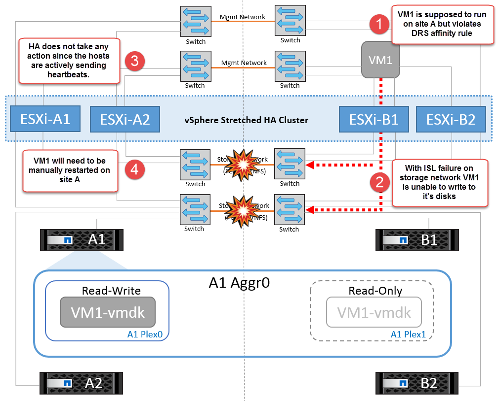

= Scénarios de panne pour vMSC avec MCC
:hardbreaks:
:allow-uri-read: 
:nofooter: 
:icons: font
:linkattrs: 
:imagesdir: ../media/

[role="lead"]
Les sections suivantes décrivent les résultats attendus de différents scénarios de défaillance avec les systèmes vMSC et NetApp MetroCluster.

== Défaillance d'un seul chemin de stockage

Dans ce scénario, si des composants tels que le port HBA, le port réseau, le port du commutateur de données frontal ou un câble FC ou Ethernet échouent, ce chemin particulier vers le périphérique de stockage est marqué comme mort par l'hôte ESXi. Si plusieurs chemins sont configurés pour le périphérique de stockage en fournissant la résilience au niveau du port HBA/réseau/commutateur, ESXi effectue idéalement un basculement de chemin. Pendant cette période, les ordinateurs virtuels restent en fonctionnement sans être affectés, car la disponibilité du stockage est assurée par plusieurs chemins vers le périphérique de stockage.

*Note:* il n'y a pas de changement dans le comportement de MetroCluster dans ce scénario, et tous les datastores continuent d'être intacts de leurs sites respectifs.

=== _Meilleure pratique_

Dans les environnements dans lesquels les volumes NFS/iSCSI sont utilisés, NetApp recommande de configurer au moins deux liaisons montantes réseau pour le port vmkernel NFS dans le vSwitch standard et la même pour le groupe de ports où l'interface vmkernel NFS est mappée pour le vSwitch distribué. Le regroupement de cartes réseau peut être configuré en mode actif-actif ou actif-veille.

En outre, pour les LUN iSCSI, les chemins d'accès multiples doivent être configurés en liant les interfaces vmkernel aux adaptateurs réseau iSCSI. Pour plus d'informations, reportez-vous à la documentation sur le stockage vSphere.

=== _Meilleure pratique_

Dans les environnements dans lesquels des LUN Fibre Channel sont utilisées, NetApp recommande d'avoir au moins deux HBA, ce qui garantit la résilience au niveau des HBA/ports. NetApp recommande également la segmentation entre un initiateur unique et une seule cible comme meilleure pratique pour la configuration de la segmentation.

Virtual Storage Console (VSC) doit être utilisé pour définir des règles de chemins d'accès multiples, car il définit des règles pour tous les périphériques de stockage NetApp, nouveaux ou existants.

== Défaillance d'un hôte ESXi unique

image::../media/vmsc_5_1.png[Défaillance d'un seul hôte.,624,598]

Dans ce scénario, en cas de défaillance de l'hôte ESXi, le nœud maître du cluster VMware HA détecte la panne de l'hôte, car il ne reçoit plus de pulsations réseau. Pour déterminer si l'hôte est réellement en panne ou uniquement une partition réseau, le nœud maître surveille les pulsations du datastore et, s'il est absent, il effectue une vérification finale en envoyant une requête ping aux adresses IP de gestion de l'hôte en panne. Si toutes ces vérifications sont négatives, le nœud maître déclare cet hôte comme étant en panne et toutes les machines virtuelles qui s'exécutaient sur cet hôte en panne sont redémarrées sur l'hôte survivant du cluster.

Si les règles d'affinité des machines virtuelles DRS et des hôtes ont été configurées (les machines virtuelles du groupe de machines virtuelles sitea_vm doivent exécuter des hôtes dans le groupe d'hôtes sitea_hosts), le maître haute disponibilité vérifie d'abord les ressources disponibles sur le site A. Si aucun hôte n'est disponible sur le site A, le maître tente de redémarrer les machines virtuelles sur les hôtes du site B.

Il est possible que les machines virtuelles soient démarrées sur les hôtes ESXi de l'autre site s'il existe une contrainte de ressource sur le site local. Cependant, les règles d'affinité VM et hôte DRS définies seront correctes si des règles sont enfreintes en migrant les machines virtuelles vers des hôtes ESXi survivants sur le site local. Dans les cas où DRS est défini sur manuel, NetApp recommande d'invoquer DRS et d'appliquer les recommandations pour corriger le positionnement de la machine virtuelle.

Dans ce scénario, le comportement de MetroCluster n'a pas changé et tous les datastores sont toujours intacts sur leurs sites respectifs.

== Isolation de l'hôte ESXi

image::../media/vmsc_5_2.png[Isolation de l'hôte ESXi,624,301]

Dans ce scénario, si le réseau de gestion de l'hôte ESXi est en panne, le nœud principal du cluster HA ne recevra aucun battement de cœur. Cet hôte est donc isolé dans le réseau. Pour déterminer s'il a échoué ou s'il est isolé uniquement, le nœud maître commence à surveiller le battement de cœur du datastore. S'il est présent, l'hôte est déclaré isolé par le nœud maître. Selon la réponse d'isolement configurée, l'hôte peut choisir de mettre hors tension, d'arrêter les machines virtuelles ou même de laisser les machines virtuelles sous tension. L'intervalle par défaut pour la réponse d'isolement est de 30 secondes.

Dans ce scénario, le comportement de MetroCluster n'a pas changé et tous les datastores sont toujours intacts sur leurs sites respectifs.

== Panne de tiroir disque

Dans ce scénario, il y a une panne de plus de deux disques ou d'un tiroir entier. Les données sont servies depuis le plex opérationnel sans interruption des services de données. La défaillance de disque peut affecter un plex local ou distant. Les agrégats s'affichent en mode dégradé, car un seul plex est actif. Une fois les disques défaillants remplacés, les agrégats affectés resynchroniseront automatiquement pour reconstruire les données. Après la resynchronisation, les agrégats reviennent automatiquement en mode miroir normal. Si plus de deux disques au sein d'un même groupe RAID sont défaillants, le plex doit être reconstruit à partir de zéro.

image::../media/vmsc_5_3.png[Une panne de tiroir disque.,624,576]

*Remarque :* au cours de cette période, il n'y a pas d'impact sur les opérations d'E/S de la machine virtuelle, mais les performances sont dégradées car les données sont accessibles depuis le tiroir disque distant via les liaisons ISL.

== Panne d'un seul contrôleur de stockage

Dans ce scénario, l'un des deux contrôleurs de stockage tombe en panne sur un site. Comme il existe une paire haute disponibilité sur chaque site, la panne d'un nœud entraîne le basculement vers l'autre nœud de manière transparente et automatique. Par exemple, si le nœud A1 tombe en panne, son stockage et ses charges de travail sont automatiquement transférés vers le nœud A2. Les machines virtuelles ne seront pas affectées, car tous les plexes restent disponibles. Les nœuds du second site (B1 et B2) ne sont pas affectés. En outre, vSphere HA ne prendra aucune action, car le nœud maître du cluster recevra toujours les battements de cœur du réseau.

image::../media/vmsc_5_4.png[Défaillance d'un seul nœud,624,603]

Si le basculement fait partie d'un incident en cours (le nœud A1 bascule vers A2) et qu'il y a une panne ultérieure de A2, ou la panne complète du site A, le basculement après un incident peut se produire sur le site B.

== Défaillances de liaison entre commutateurs

=== Défaillance de la liaison inter-commutateur sur le réseau de gestion

image::../media/vmsc_5_5.png[Défaillance de la liaison entre les commutateurs au niveau du réseau de gestion,624,184]

Dans ce scénario, si les liaisons ISL du réseau de gestion de l'hôte frontal tombent en panne, les hôtes ESXi du site A ne pourront pas communiquer avec les hôtes ESXi du site B. Cela entraîne une partition réseau, car les hôtes ESXi d'un site particulier ne peuvent pas envoyer les battements de cœur du réseau au nœud maître du cluster HA. Ainsi, il y aura deux segments de réseau en raison de la partition et il y aura un nœud maître dans chaque segment qui protégera les machines virtuelles des défaillances de l'hôte au sein du site particulier.

*Remarque :* pendant cette période, les machines virtuelles restent en cours d'exécution et il n'y a pas de changement dans le comportement de MetroCluster dans ce scénario. Tous les datastores sont toujours intacts sur leurs sites respectifs.

=== Défaillance de la liaison intercommutateur sur le réseau de stockage

image::../media/vmsc_5_6.png[Défaillance de la liaison de l'interswitch au niveau du réseau de stockage,624,481]

Dans ce scénario, si les liaisons ISL du réseau de stockage back-end tombent en panne, les hôtes du site A perdront l'accès aux volumes de stockage ou aux LUN du cluster B sur le site B et vice versa. Les règles VMware DRS sont définies de manière à ce que l'affinité entre l'hôte et le site de stockage facilite l'exécution des machines virtuelles sans impact sur le site.

Pendant cette période, les machines virtuelles restent en cours d'exécution sur leurs sites respectifs et le comportement de MetroCluster n'a pas changé dans ce scénario. Tous les datastores sont toujours intacts sur leurs sites respectifs.

Si, pour une raison quelconque, la règle d'affinité a été enfreinte (par exemple, VM1, qui était censé s'exécuter à partir du site A où ses disques résident sur les nœuds du cluster A local, s'exécute sur un hôte du site B), le disque de la machine virtuelle est accessible à distance via des liens ISL. En raison d'une défaillance de la liaison ISL, VM1 exécuté sur le site B ne pouvait pas écrire sur ses disques, car les chemins vers le volume de stockage sont en panne et cette machine virtuelle est en panne. Dans ce cas, VMware HA ne prend aucune action, car les hôtes envoient activement des battements du cœur. Ces machines virtuelles doivent être manuellement désactivées et activées sur leurs sites respectifs. La figure suivante illustre une machine virtuelle violant une règle d'affinité DRS.

=== Défaillance de tous les commutateurs ou partition complète du centre de données

Dans ce scénario, toutes les liaisons ISL entre les sites sont en panne et les deux sites sont isolés les uns des autres. Comme nous l'avons vu dans les scénarios précédents, tels que la défaillance des liens ISL au niveau du réseau de gestion et du réseau de stockage, les machines virtuelles ne sont pas affectées par la défaillance complète des liens ISL.

Une fois les hôtes ESXi partitionnés entre les sites, l'agent vSphere HA vérifie la présence de battements de cœur du datastore et, sur chaque site, les hôtes ESXi locaux pourront mettre à jour les battements de cœur du datastore vers leur volume/LUN de lecture/écriture respectif. Les hôtes du site A partent du principe que les autres hôtes ESXi du site B ont échoué car il n'y a pas de pulsations réseau/datastore. VSphere HA sur le site A tentera de redémarrer les machines virtuelles du site B, ce qui finira par échouer car les datastores du site B ne seront pas accessibles en raison d'une panne de lien ISL du stockage. Une situation similaire est répétée sur le site B.

image::../media/vmsc_5_8.png[Toute panne de lien ISL ou partition complète du data Center,624,596]

NetApp recommande de déterminer si une machine virtuelle a enfreint les règles DRS. Toutes les machines virtuelles exécutées à partir d'un site distant sont en panne, car elles ne pourront pas accéder au datastore. VSphere HA redémarrera cette machine virtuelle sur le site local. Une fois les liens ISL de nouveau en ligne, la machine virtuelle qui s'exécutait sur le site distant est arrêtée, car il ne peut pas y avoir deux instances de machines virtuelles fonctionnant avec les mêmes adresses MAC.

image::../media/vmsc_5_9.png[Partition de centre de données où VM1 a violé une règle d'affinité DRS,624,614]

=== Défaillance de la liaison inter-commutateur sur les deux fabriques dans NetApp MetroCluster

Dans le cas d'une défaillance d'un ou de plusieurs liens ISL, le trafic continue à travers les liens restants. Si toutes les liaisons ISL des deux structures échouent, de sorte qu'il n'y ait pas de liaison entre les sites pour le stockage et la réplication NVRAM, chaque contrôleur continue de transmettre ses données locales. Lors de la restauration d'un ISL au moins, la resynchronisation de tous les plexes se fera automatiquement.

Toute écriture effectuée après l'arrêt de toutes les ISL ne sera pas mise en miroir sur l'autre site. Un basculement sur incident, dans cet état, entraînerait la perte des données non synchronisées. Dans ce cas, une intervention manuelle est requise pour la restauration après le basculement. S'il est probable qu'aucune ISL ne soit disponible pendant une période prolongée, l'administrateur peut choisir de fermer tous les services de données afin d'éviter tout risque de perte de données en cas de basculement en cas d'incident. L'exécution de cette action doit être comparée à la probabilité d'un incident nécessitant un basculement avant qu'au moins un lien ISL ne soit disponible. Sinon, si les liens ISL échouent dans un scénario en cascade, un administrateur peut déclencher un basculement planifié vers l'un des sites avant que tous les liens n'aient échoué.

image::../media/vmsc_5_10.png[Défaillance de la liaison entre les commutateurs sur les deux fabriques du NetApp MetroCluster.,624,597]

=== Défaillance du lien de peering de cluster

Dans le cas d'une défaillance de liaison de cluster peering, les liens ISL de la structure sont toujours actifs, les services de données (lectures et écritures) continuent sur les deux sites vers les deux plexes. Toute modification de la configuration du cluster (par exemple, ajout d'un SVM, provisionnement d'un volume ou d'une LUN dans un SVM existant) ne peut pas être propagée à l'autre site. Ils sont conservés dans les volumes de métadonnées CRS locaux et automatiquement propagés à l'autre cluster lors de la restauration du lien du cluster peering. Si un basculement forcé est nécessaire avant la restauration de la liaison de cluster peering, les modifications de la configuration du cluster en attente seront automatiquement lues à partir de la copie répliquée à distance des volumes de métadonnées sur le site survivant dans le cadre du processus de basculement.

image::../media/vmsc_5_11.png[Défaillance du lien de peering de cluster,624,303]

=== Défaillance complète du site

Dans un scénario de défaillance de site complet A, les hôtes ESXi du site B n'obtiennent pas la pulsation réseau des hôtes ESXi du site A car ils sont en panne. Le maître haute disponibilité sur le site B vérifie que les pulsations du datastore ne sont pas présentes, déclare que les hôtes du site A sont en panne et tente de redémarrer le site A des machines virtuelles sur le site B. Pendant cette période, l'administrateur du stockage effectue un basculement pour reprendre les services des nœuds défaillants sur le site survivant, ce qui restaure tous les services de stockage du site A sur le site B. Une fois que les volumes ou les LUN du site A sont disponibles sur le site B, l'agent principal de haute disponibilité tente de redémarrer le site A des machines virtuelles sur le site B.

Si la tentative de redémarrage d'une machine virtuelle par l'agent principal vSphere HA (qui implique son enregistrement et sa mise sous tension) échoue, le redémarrage est relancé après un délai. Le délai entre les redémarrages peut être configuré jusqu'à un maximum de 30 minutes. VSphere HA tente ces redémarrages au maximum pour un nombre maximal de tentatives (six tentatives par défaut).

*Remarque :* le maître HA ne lance pas les tentatives de redémarrage tant que le gestionnaire de placement n'a pas trouvé le stockage approprié, donc dans le cas d'une défaillance complète du site, ce serait une fois le basculement effectué.

Si le site A été basculé, la panne suivante de l'un des nœuds du site B survivant peut être gérée de manière transparente par le basculement vers le nœud survivant. Dans ce cas, le travail de quatre nœuds est désormais effectué par un seul nœud. Dans ce cas, la restauration consiste à effectuer un rétablissement vers le nœud local. Ensuite, lorsque le site A est restauré, une opération de rétablissement est effectuée pour restaurer le fonctionnement en état stable de la configuration.

image::../media/vmsc_5_12.png[Les pannes générales du site,624,593]
